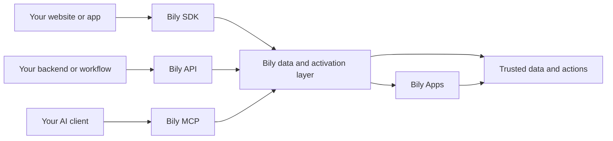

Bily is the programmable customer data and activation layer for websites.

Connect a site once to collect and normalize events, route trusted data, and run governed work across browser, server, and AI surfaces. Bily keeps these surfaces aligned around the same website, organization, and customer data context.

[Bily Apps](/concepts/bily-apps) is the installable capability layer of Bily. It gives teams a governed way to add reusable capabilities without turning Bily itself into a collection of one-off scripts.

## The Bily model

<CardGroup cols={2}>
  <Card title="Connected customer data" icon="database">
    Collect and normalize website events once so browser, server, and AI workflows share a dependable context.
  </Card>
  <Card title="Trusted routing" icon="route">
    Route data through explicit website, organization, and store boundaries.
  </Card>
  <Card title="Governed activation" icon="shield-check">
    Run supported reads and actions through authenticated developer surfaces with clear scope.
  </Card>
  <Card title="Bily Apps" icon="puzzle-piece">
    Install and evolve reusable capabilities through the Bily connection a site already maintains.
  </Card>
</CardGroup>

## How the developer surfaces fit

The [JavaScript SDK](/api-reference/overview) is the browser contract. It installs Bily once and sends page, product, checkout, and custom events.

The [Bily API](/rest-api/overview) is the server contract. It lets your own tools read scoped analytics and store state, and perform supported actions with explicit authentication.

The [Bily MCP](/mcp/overview) is the AI-client contract. It lets compatible clients discover the current operation catalog and run scoped work with Bily authentication.

All three surfaces connect to the same Bily layer. The API and MCP enforce Bily identity, organization, and store access for authenticated server and AI work.

## Designed to evolve

Bily gives your team one stable foundation for customer data, activation, safety, and observability. You can adopt Bily Apps without repeatedly rebuilding your website integration.

Your team keeps control of:

- which sites and stores are connected;
- which Bily Apps are installed and enabled;
- which organization can access each store;
- which API keys can read data or perform actions;
- when a Bily App or configuration reaches customers.

<CardGroup cols={2}>
  <Card title="Install the SDK" icon="code" href="/quickstart">
    Connect a website and send your first event.
  </Card>
  <Card title="Explore Bily Apps" icon="puzzle-piece" href="/concepts/bily-apps">
    Review the installable capability layer built for the Bily connection.
  </Card>
  <Card title="Call the Bily API" icon="terminal" href="/rest-api/quickstart">
    Authenticate a server request and discover your stores.
  </Card>
  <Card title="Connect an AI client" icon="robot" href="/mcp/quickstart">
    Connect through Bily MCP and discover supported operations.
  </Card>
</CardGroup>
