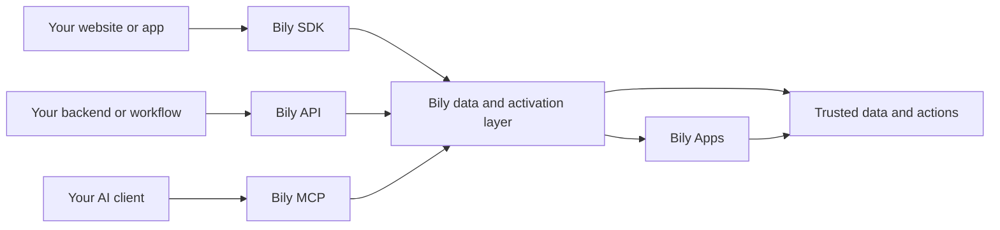

Bily is the programmable customer data and activation layer for your website.

Connect a site once to collect consistent events, route trusted data, and run governed browser, server, and AI workflows. Every surface stays aligned to the same website, organization, and customer data context.

[Bily Apps](/concepts/bily-apps) adds reusable capabilities through that connection. You can expand what Bily does without managing a new script for every capability.

## What one connection gives you

<CardGroup cols={2}>
  <Card title="Connected customer data" icon="database">
    Collect consistent website events once, then share dependable context across browser, server, and AI workflows.
  </Card>
  <Card title="Trusted routing" icon="route">
    Keep data within explicit website, organization, and store boundaries.
  </Card>
  <Card title="Governed activation" icon="shield-check">
    Run supported reads and actions through authenticated surfaces with clear scope.
  </Card>
  <Card title="Bily Apps" icon="puzzle-piece">
    Install and evolve reusable capabilities through the Bily connection you already maintain.
  </Card>
</CardGroup>

## Use the right surface for each job

Use the [JavaScript SDK](/api-reference/overview) in the browser. It installs Bily once and sends page, product, checkout, and custom events.

Use the [Bily API](/rest-api/overview) on the server. Your tools can read scoped analytics and store state, then perform supported actions with explicit authentication.

Use [Bily MCP](/mcp/overview) in compatible AI clients. They can discover the current operation catalog and run scoped work with Bily authentication.

All three connect to the same Bily layer. The API and MCP enforce identity, organization, and store access for authenticated server and AI work.

## Grow without rebuilding

Bily gives your team one stable foundation for customer data, activation, safety, and observability. Add Bily Apps as your needs change, without rebuilding the website integration.

You control:

- which sites and stores are connected;
- which Bily Apps are installed and enabled;
- which organization can access each store;
- which API keys can read data or perform actions;
- when a Bily App or configuration reaches customers.

<CardGroup cols={2}>
  <Card title="Install the SDK" icon="code" href="/quickstart">
    Connect your website and send your first event.
  </Card>
  <Card title="Explore Bily Apps" icon="puzzle-piece" href="/concepts/bily-apps">
    See what you can install through your Bily connection.
  </Card>
  <Card title="Call the Bily API" icon="terminal" href="/rest-api/quickstart">
    Authenticate your server and discover its stores.
  </Card>
  <Card title="Connect an AI client" icon="robot" href="/mcp/quickstart">
    Connect through Bily MCP and discover supported operations.
  </Card>
</CardGroup>
