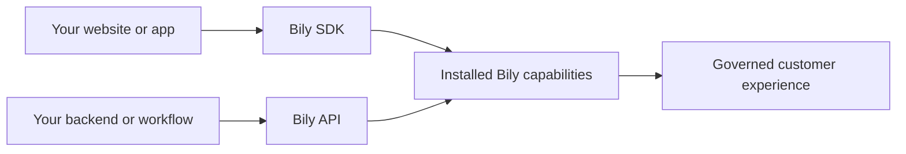

Bily is an app store for the internet: one trusted catalog and runtime for reusable web capabilities.

Installing a web capability should feel like installing an app: review what it can access, configure it for the site, enable it, then update or revoke it centrally. Developers build a capability once for many sites; each team chooses how and where it runs.

Instead of stitching together separate scripts, integrations, and release processes, you install capabilities through Bily and manage them as one product surface. Bily keeps the customer-facing contract stable while each capability can improve over time.

## The Bily model

<CardGroup cols={2}>
  <Card title="Installable capabilities" icon="puzzle-piece">
    Add analytics, advertising, customer-data, and automation capabilities without rebuilding the same integration for every site.
  </Card>
  <Card title="Consent and governance" icon="shield-check">
    Control which capabilities run, what they can access, and how changes move from configuration to production.
  </Card>
  <Card title="First-party delivery" icon="globe">
    Deliver capabilities from your own web presence so your customer experience stays consistent and dependable.
  </Card>
  <Card title="One integration" icon="link">
    Connect a site once, then add or evolve capabilities without asking every team to maintain another loader.
  </Card>
</CardGroup>

## How the developer surfaces fit

The [JavaScript SDK](/api-reference/overview) is the browser contract. It installs Bily once and sends page, product, checkout, and custom events.

The [Bily API](/rest-api/overview) is the server contract. It lets your own tools read scoped analytics and store state, and perform supported actions with explicit authentication.

Both surfaces use the same Bily identity, organization, and store boundaries. You can start with one website integration and extend it as your product grows.

## Designed to evolve

Bily gives your team one stable foundation for delivery, safety, observability, and an expanding catalog of capabilities. You can adopt new capabilities without repeatedly rebuilding your website integration.

Your team keeps control of:

- which sites and stores are connected;
- which capabilities are enabled;
- which organization can access each store;
- which API keys can read data or perform actions;
- when a new capability or configuration reaches customers.

<CardGroup cols={2}>
  <Card title="Install the SDK" icon="code" href="/quickstart">
    Connect a website and send your first event.
  </Card>
  <Card title="Call the Bily API" icon="terminal" href="/rest-api/quickstart">
    Authenticate a server request and discover your stores.
  </Card>
</CardGroup>
