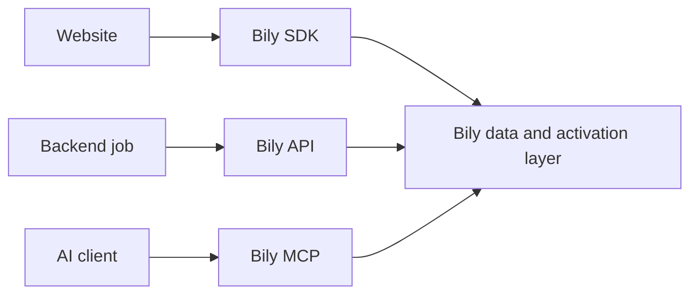

The Bily API and Bily MCP expose overlapping Bily data and supported actions for different kinds of callers. Choose based on who controls the workflow and how predictable the contract must be.

## Decision table

| Need | Use |
| --- | --- |
| Send website events | Bily JavaScript SDK |
| Build a backend integration against versioned endpoints | Bily API |
| Run a scheduled or repeatable server job | Bily API |
| Generate a typed client from OpenAPI | Bily API |
| Let a compatible AI client discover a current Bily operation | Bily MCP |
| Perform an operator-reviewed analysis or action in an AI client | Bily MCP |
| Combine browser collection, automation, and interactive analysis | SDK plus API and/or MCP |

## Choose the Bily API

Use the API when application code owns the sequence.

The API is a good fit for:

- scheduled analytics exports;
- store and account synchronization jobs;
- internal dashboards and reporting services;
- explicit create, update, toggle, clone, or delete workflows;
- integrations that need stable paths, request bodies, response schemas, and status codes.

API requests use the versioned base URL and server-side authentication. Your application owns retries, idempotency decisions, verification, and error handling.

<Card title="Bily API overview" icon="terminal" href="/rest-api/overview">
  Review authentication, scoping, errors, and the generated endpoint reference.
</Card>

## Choose Bily MCP

Use MCP when a compatible AI client should interpret a user's intent and discover the current Bily operation catalog.

Bily MCP exposes two stable tools:

- `search` finds supported Bily operations and their planning guidance;
- `execute` runs a focused async function with the selected `bily.*` helper.

MCP is a good fit for:

- interactive questions about stores and analytics;
- exploratory work where the exact helper should be discovered at runtime;
- operator-reviewed actions where the client shows the complete execution first;
- AI workflows that benefit from operation schemas, risk guidance, and verification hints.

MCP planning metadata is advisory. Keep client approval visible and verify writes with a read.

<Card title="Bily MCP overview" icon="robot" href="/mcp/overview">
  Connect an AI client and review the two-tool contract.
</Card>

## Use more than one surface

A common architecture uses each surface for the work it owns:

For example, the SDK can send product and order events, a backend job can read a daily analytics dataset through the API, and an operator can investigate a result through MCP.

## Do not substitute the wrong surface

- Do not place an API key in browser code.
- Do not use MCP as the website event transport.
- Do not use the browser SDK for scheduled server jobs.
- Do not call undocumented Bily endpoints when an OpenAPI operation exists.
- Do not hard-code MCP helper names without first using `search` for the current contract.

## Operational tradeoffs

| Consideration | API | MCP |
| --- | --- | --- |
| Contract discovery | OpenAPI and endpoint reference | `search` results |
| Caller | Trusted server code | Compatible AI client |
| Execution shape | One HTTP request per endpoint | Focused async function using Bily helpers |
| Typical authorization | Server-side API key | Bily Connect or store-scoped fallback key |
| Approval | Your application workflow | Client prompt plus advisory planning metadata |
| Runtime responsibility | Your service | MCP execution limit and client timeout |
| Best for | Repeatable deterministic integrations | Intent-driven operator workflows |

If a workflow begins as an MCP investigation and becomes scheduled production logic, move the repeatable portion to the versioned API.
