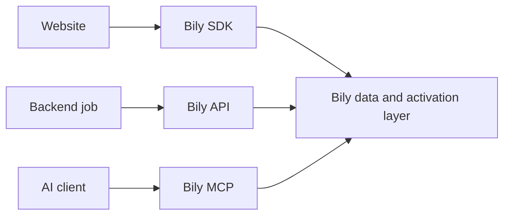

The API and MCP can access overlapping Bily data and actions. The right choice depends on who controls the workflow and how repeatable it needs to be.

## Choose by workflow

| Need | Use |
| --- | --- |
| Send website events | Bily JavaScript SDK |
| Build a backend integration with versioned endpoints | Bily API |
| Run a scheduled or repeatable server job | Bily API |
| Generate a typed client from OpenAPI | Bily API |
| Let a compatible AI client discover a current operation | Bily MCP |
| Perform an operator-reviewed analysis or action in an AI client | Bily MCP |
| Combine browser collection, automation, and interactive analysis | SDK plus API and/or MCP |

## Use the API for repeatable software

Choose the API when your application owns the sequence.

Use it for:

- scheduled analytics exports;
- store and account synchronization jobs;
- internal dashboards and reporting services;
- explicit create, update, toggle, clone, or delete workflows;
- integrations that need stable paths, request bodies, response schemas, and status codes.

API requests use the versioned base URL and server-side authentication. Your application controls retries, idempotency decisions, verification, and errors.

<Card title="Bily API overview" icon="terminal" href="/rest-api/overview">
  Review authentication, scope, errors, and every generated endpoint.
</Card>

## Use MCP for guided AI workflows

Choose MCP when a compatible AI client should interpret your intent and discover the current operation catalog.

Bily MCP gives the client two stable tools:

- `search` finds supported Bily operations and their planning guidance;
- `execute` runs a focused async function with the selected `bily.*` helper.

Use it for:

- interactive questions about stores and analytics;
- exploratory work where the exact helper should be discovered at runtime;
- operator-reviewed actions where the client shows the complete execution before it runs;
- AI workflows that benefit from operation schemas, risk guidance, and verification hints.

MCP planning metadata is advisory. Keep the client approval visible. Verify every write with a read.

<Card title="Bily MCP overview" icon="robot" href="/mcp/overview">
  Connect your AI client and review its two-tool contract.
</Card>

## Combine surfaces when the workflow needs them

A complete implementation can give each surface one clear job:

For example, the SDK sends product and order events. A backend job reads a daily analytics dataset through the API. An operator investigates the result through MCP.

## Keep each surface in its role

- Do not place an API key in browser code.
- Do not use MCP as the website event transport.
- Do not use the browser SDK for scheduled server jobs.
- Do not call undocumented Bily endpoints when an OpenAPI operation exists.
- Do not hard-code MCP helper names without first using `search` for the current contract.

## Compare the contracts

| Consideration | API | MCP |
| --- | --- | --- |
| Contract discovery | OpenAPI and endpoint reference | `search` results |
| Caller | Trusted server code | Compatible AI client |
| Execution shape | One HTTP request per endpoint | Focused async function using Bily helpers |
| Typical authorization | Server-side API key | Bily Connect or store-scoped fallback key |
| Approval | Your application workflow | Client prompt plus advisory planning metadata |
| Runtime responsibility | Your service | MCP execution limit and client timeout |
| Best for | Repeatable deterministic integrations | Intent-driven operator workflows |

If an MCP investigation becomes scheduled production logic, move its repeatable work to the versioned API.
