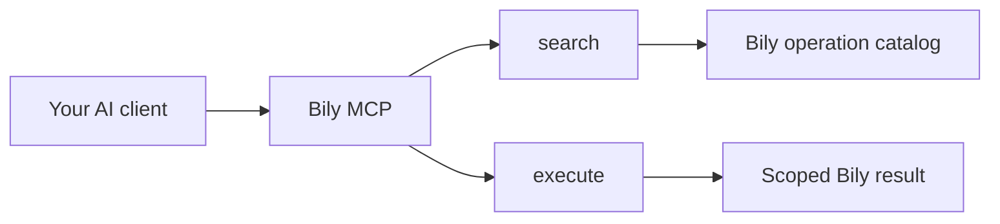

Bily MCP gives compatible AI clients a governed way to discover and run supported Bily operations. The public endpoint uses Streamable HTTP and exposes two tools:

- `search` discovers the current Bily operation catalog.
- `execute` runs an async function with the `bily.*` helper selected from that catalog.

The catalog currently contains 64 operations across identity, stores, metrics, analytics, breakdowns, connected-platform reads, and supported writes. Use `search` as the source of truth because the catalog can grow without adding another top-level MCP tool.

## How a request works

1. Your client connects to `https://api-dispatcher.bily.ai/mcp`.
2. Bily authenticates the connection and applies organization and store access.
3. The client calls `search` with the user's intent.
4. `search` returns matching helpers, inputs, risk guidance, and verification guidance.
5. The client calls `execute` with a focused async arrow function.
6. Bily returns the JSON-serializable result and captured logs.

Begin a new connection with `bily.context()`. It returns the authenticated user, accessible organizations, and each organization's nested stores in one read.

<Info>
  Bily MCP exposes tools only. It does not publish MCP resources or prompts. Use the documentation resources below for agent-readable product guidance.
</Info>

## Start here

<CardGroup cols={2}>
  <Card title="Quickstart" icon="bolt" href="/mcp/quickstart">
    Connect a client through Bily Connect and verify both tools.
  </Card>
  <Card title="Client configuration" icon="sliders" href="/mcp/client-configuration">
    Configure the endpoint, transport, sign-in flow, or fallback key.
  </Card>
  <Card title="Tools and operations" icon="wrench" href="/mcp/tools">
    Review the exact `search` and `execute` contracts.
  </Card>
  <Card title="Safety and permissions" icon="shield-check" href="/mcp/safety">
    Apply scope, approval, verification, and credential safeguards.
  </Card>
</CardGroup>

## Agent-readable documentation

- [Documentation index](https://docs.bily.ai/llms.txt) provides a compact map of the public docs.
- [Complete documentation](https://docs.bily.ai/llms-full.txt) provides the authored public content in one file.

These files are discoverability aids. They are not authentication URLs or MCP endpoints.

<Card title="Choose the API or MCP" icon="arrows-split-up-and-left" href="/guides/api-mcp-selection">
  Compare interactive AI-client work with deterministic server integrations.
</Card>
